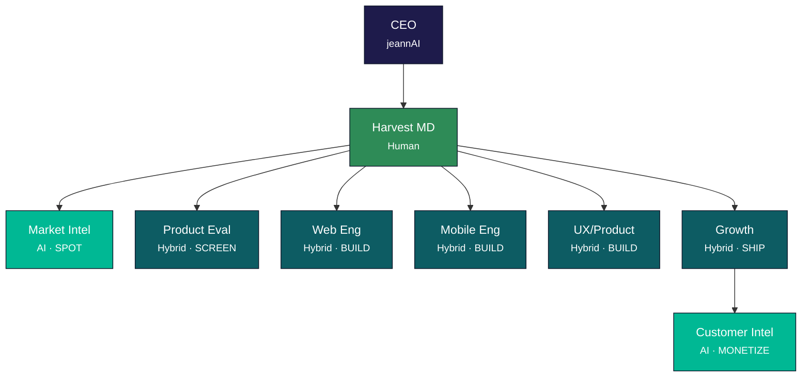

  <strong>Harvest</strong>

<h3 align="center">AI Product Boutique</h3>

Harvest builds consumer and B2B software products that leverage AI capabilities. We spot emerging opportunities, rapidly validate product-market fit, and ship polished apps across web and mobile platforms. Our lean team combines human product judgment with AI-powered execution to move from idea to market faster than traditional development.

<em>A <strong>jeannAI</strong> company</em>

---

## Organizational Structure

Harvest operates as an **AI-native product boutique** — an 8-role team (9 nodes incl. holding context) built around the core product loop: **Spot → Screen → Build → Ship → Monetize**.

> **[Open interactive org chart](https://harvestbq.github.io/.github/organigram.html)** — zoomable, expandable D3 visualization with agent details

**Legend:** Human (1) · Hybrid (5) · AI (2) · Holding (1) · **9 nodes**

---

  <strong>Harvest</strong> — Spot. Build. Ship.

